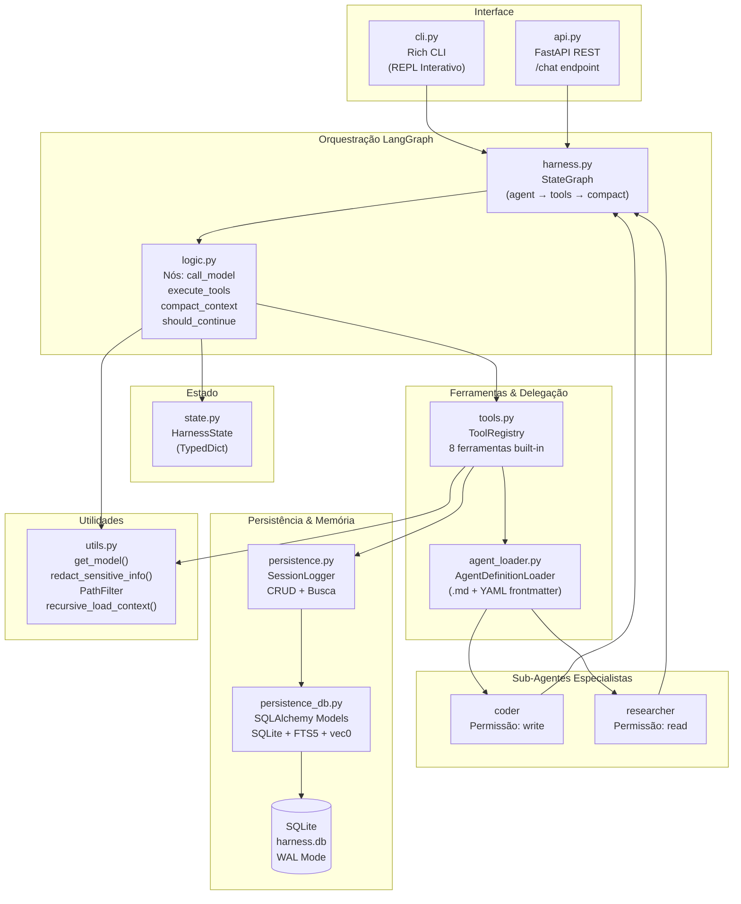
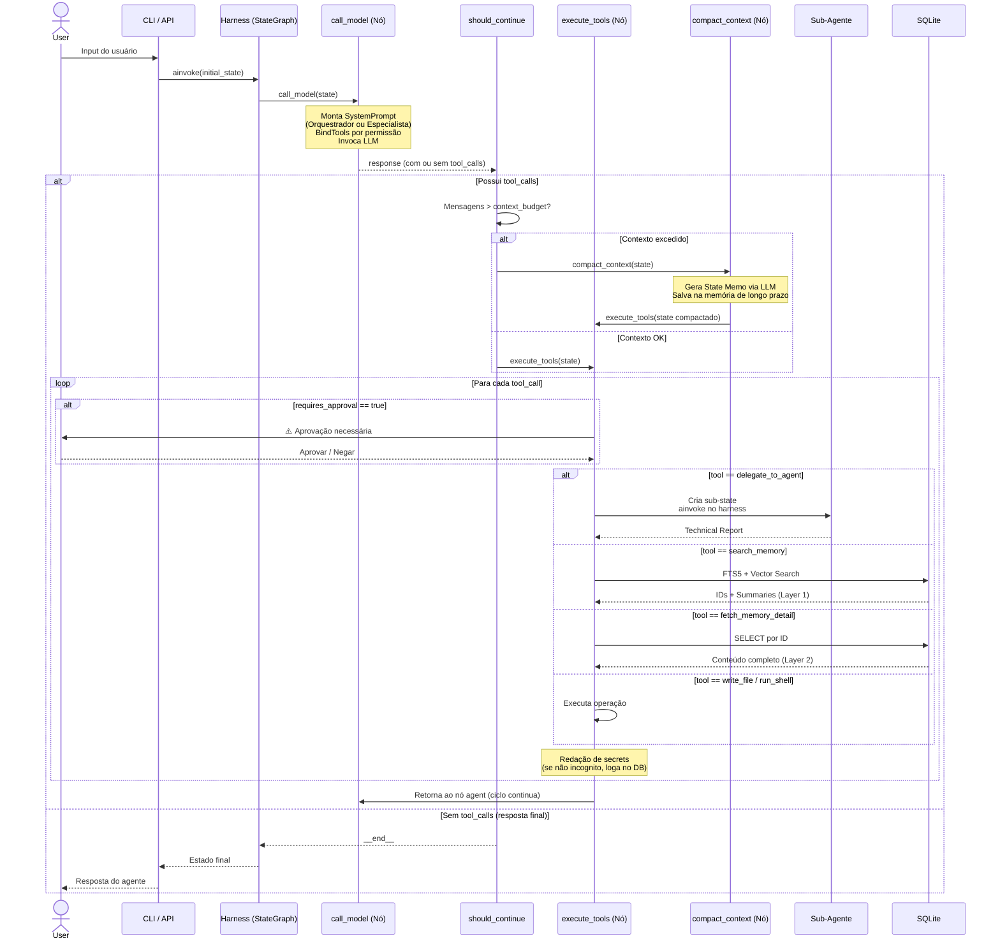
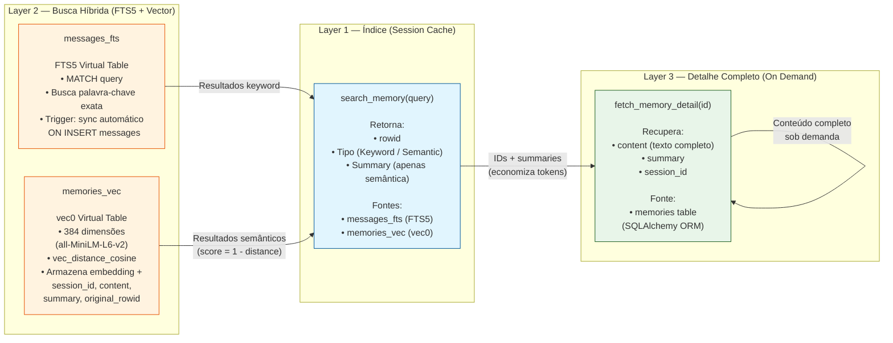
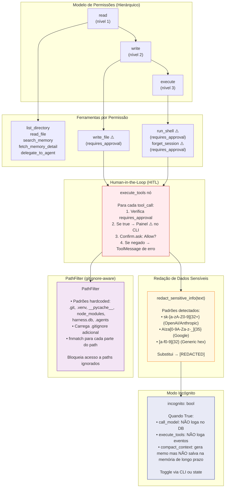
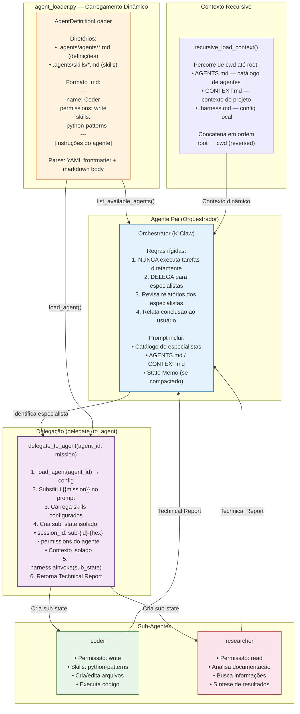
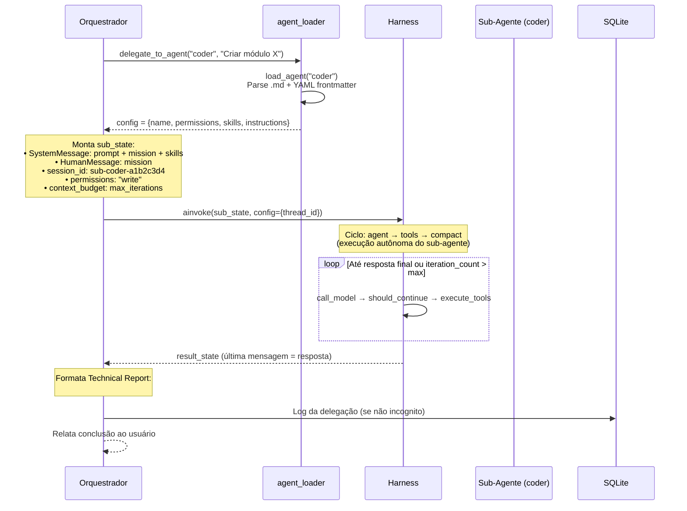
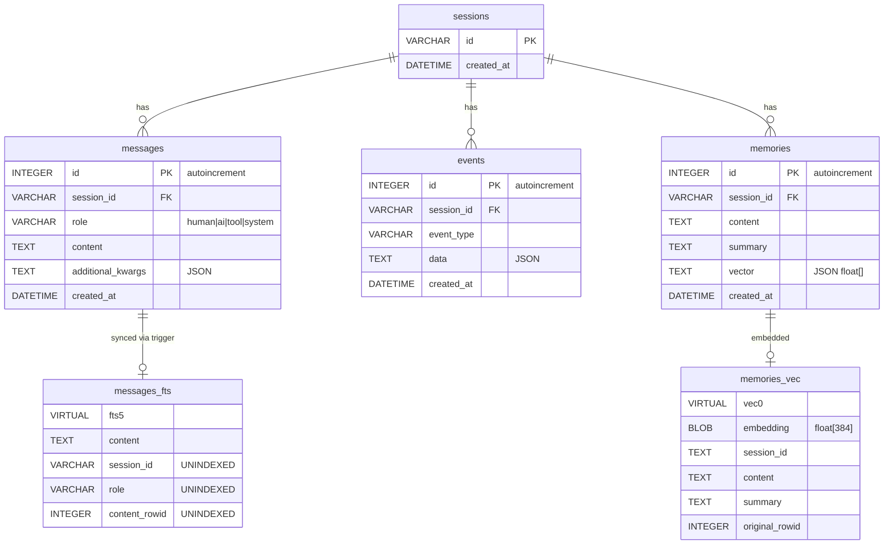

# Agent Harness — Documentação de Arquitetura

> **Versão:** 0.1.0 · **Python:** ≥3.13 · **Gerenciador de Pacotes:** `uv`

---

## 1. Visão Geral

O **Agent Harness** é um framework de orquestração multi-agente com memória em camadas, busca híbrida (FTS5 + vetorial), e controles de segurança com human-in-the-loop. O sistema implementa uma arquitetura **Agente Pai (Orquestrador) + Sub-Agentes Especialistas**, onde o Orquestrador nunca executa tarefas diretamente — apenas delega para especialistas via `delegate_to_agent`.

### Características Principais

| Característica | Descrição |
|---|---|
| **Orquestração Delegativa** | Agente Pai identifica o especialista necessário e delega; nunca executa diretamente |
| **Memória em 3 Camadas** | L1: Cache de Sessão → L2: FTS5 + Busca Vetorial → L3: Detalhe Completo sob Demanda |
| **Busca Híbrida** | FTS5 (palavra-chave exata) + sqlite-vec (similaridade semântica com cosseno) |
| **Human-in-the-Loop** | Portas de aprovação interativas antes de operações destrutivas (`write_file`, `run_shell`, `forget_session`) |
| **Modo Incógnito** | Suspende toda persistência — nenhum log é gravado no SQLite |
| **Redação de Segredos** | Chaves de API e secrets são automaticamente mascarados via regex |
| **Compactação de Contexto** | Geração automática de "State Memo" quando o orçamento de contexto é excedido |
| **Carregamento Dinâmico** | Sub-agentes definidos em `.md` com YAML frontmatter; skills injetados na delegação |

---

## 2. Diagrama de Arquitetura de Alto Nível



---

## 3. Diagrama de Fluxo de Execução



---

## 4. Diagrama de Camadas de Memória



### Detalhes das Camadas

| Camada | Função | Tabela SQLite | Tokens Salvos |
|---|---|---|---|
| **Layer 1** | Índice com IDs + summaries — primeira chamada de `search_memory` | `messages_fts` + `memories_vec` | Alto — retorna apenas referências |
| **Layer 2** | Busca híbrida: FTS5 para palavra-chave, vec0 para similaridade semântica | `messages_fts` (FTS5) e `memories_vec` (vec0) | — |
| **Layer 3** | Conteúdo completo sob demanda via `fetch_memory_detail` | `memories` (SQLAlchemy ORM) | Consumo apenas quando necessário |

---

## 5. Diagrama de Segurança e Permissões



### Regras de Segurança

| Mecanismo | Quando Aplica | Implementação |
|---|---|---|
| **Approval Gate** | `write_file`, `run_shell`, `forget_session` | `requires_approval=True` no `ToolDescriptor` |
| **Redação** | Toda saída de modelo e resultado de ferramenta | `redact_sensitive_info()` em `call_model` e `execute_tools` |
| **Modo Incógnito** | Ativado pelo usuário | `state["incognito"]` — bypass de todos os `SessionLogger` writes |
| **PathFilter** | `list_directory`, `read_file`, `write_file` | `path_filter.is_ignored(path)` — bloqueia acesso |
| **Hierarquia de Permissões** | `get_langchain_tools(current_permissions)` | read(1) ≤ write(2) ≤ execute(3) |

---

## 6. Diagrama de Multi-Agent Orchestration



### Fluxo de Delegação Detalhado



---

## 7. Stack Tecnológico

| Categoria | Tecnologia | Versão/Uso |
|---|---|---|
| **Linguagem** | Python | ≥ 3.13 |
| **Orquestração** | LangGraph | ≥ 1.2.4 — `StateGraph` com nós e arestas condicionais |
| **LLM Framework** | LangChain | ≥ 1.3.4 — `init_chat_model`, message types |
| **Providers LLM** | langchain-openai | ≥ 1.2.2 — OpenAI, OpenRouter |
| | langchain-anthropic | ≥ 1.4.4 — Claude |
| | langchain-openrouter | ≥ 0.2.3 — OpenRouter bridge |
| **Embeddings** | langchain-huggingface | ≥ 1.2.2 — `all-MiniLM-L6-v2` (384 dims) |
| | sentence-transformers | ≥ 5.5.1 — Modelo de embeddings local |
| **API** | FastAPI | ≥ 0.136.3 — REST endpoint `/chat` |
| | Uvicorn | ≥ 0.49.0 — ASGI server |
| **Banco de Dados** | SQLite | Built-in — WAL mode, FTS5, sqlite-vec |
| | SQLAlchemy | ≥ 2.0.50 — ORM (declarative_base) |
| | sqlite-vec | ≥ 0.1.9 — Extensão vetorial nativa SIMD |
| **CLI** | Rich | ≥ 15.0.0 — Tabelas, painéis, prompts, status |
| **Validação** | Pydantic | ≥ 2.13.4 — `BaseModel` para requests/responses |
| **Configuração** | PyYAML | ≥ 6.0.3 — Parse de YAML frontmatter |
| | python-dotenv | ≥ 1.2.2 — Variáveis de ambiente `.env` |
| **Observabilidade** | LangSmith | ≥ 0.8.9 — Tracing (opcional) |
| **Gerenciador** | uv | Lock file, resolução de dependências |

---

## 8. Descrição Detalhada de Cada Componente

### 8.1 `harness.py` — Graph Orquestrador LangGraph

**Responsabilidade:** Define e compila o `StateGraph` que orquestra o ciclo de vida do agente.

```python
# Estrutura do Grafo:
START → "agent" → should_continue → "tools" → "agent" (loop)
                                  → "compact" → "tools" → "agent"
                                  → "__end__" (resposta final)
```

- **Nós:** `agent` (call_model), `tools` (execute_tools), `compact` (compact_context)
- **Arestas condicionais:** `should_continue` decide o próximo nó baseado em `tool_calls` e `context_budget`
- **Checkpointer:** `MemorySaver` do LangGraph para persistência de estado entre turns
- **Late binding:** `set_harness_refs()` fornece referência circular ao `delegate_to_agent`

### 8.2 `logic.py` — Lógica dos Nós do Grafo

**Responsabilidade:** Contém toda a lógica de execução dos nós do StateGraph.

#### `assemble_system_prompt(state) → SystemMessage`

- Se `session_id.startswith("sub-")` → **Prompt de Especialista** (ultra-leve: missão + permissões + anti-hallucination)
- Senão → **Prompt do Orquestrador**: regras de delegação + catálogo de especialistas (`list_available_agents()`) + contexto recursivo + State Memo

#### `call_model(state) → dict`

1. Invoca `assemble_system_prompt` para montar o prompt
2. Bind tools filtrado por `state["permissions"]` via `registry.get_langchain_tools()`
3. Invoca LLM com `ainvoke`
4. Redação automática de secrets (`redact_sensitive_info`)
5. Log no DB (se não incognito)

#### `should_continue(state) → Literal["tools", "compact", "__end__"]`

- Se `iteration_count > 25` → `__end__` (safety cap)
- Se `tool_calls` presentes e `len(messages) > context_budget` → `compact`
- Se `tool_calls` presentes → `tools`
- Senão → `__end__` (resposta final)

#### `execute_tools(state) → dict`

1. Itera sobre `tool_calls` do último `AIMessage`
2. Verifica `requires_approval` → interrompe para aprovação do usuário (HITL)
3. Executa `handler.ainvoke(tool_args)`
4. Redação de secrets no resultado
5. Log de evento e mensagens (se não incognito)
6. Retorna lista de `ToolMessage`

#### `compact_context(state) → dict`

1. Separa mensagens: `to_prune = messages[:-5]` e `keep = messages[-5:]`
2. Solicita ao LLM que gere um **State Memo** (resumo técnico estruturado)
3. Salva na memória de longo prazo via `create_long_term_memory(content, summary)`
4. Retorna `{messages: keep, context_summary: state_memo}`

### 8.3 `state.py` — Definição de Estado

**Responsabilidade:** Define o TypedDict que representa o estado compartilhado do grafo.

| Campo | Tipo | Descrição |
|---|---|---|
| `messages` | `Annotated[List[BaseMessage], add_messages]` | Histórico de mensagens (LangGraph reducer) |
| `context_budget` | `int` | Limite de mensagens antes da compactação |
| `iteration_count` | `int` | Contador de segurança (cap em 25) |
| `session_id` | `str` | Identificador da sessão (UUID ou `sub-{agent}-{hex}`) |
| `permissions` | `str` | Nível de permissão: `"read"`, `"write"`, `"execute"` |
| `context_summary` | `str` | State Memo gerado pela compactação |
| `incognito` | `bool` | Se `True`, nenhum log é persistido |

### 8.4 `tools.py` — Registry e Ferramentas Built-in

**Responsabilidade:** Registra ferramentas, gerencia permissões e implementa todas as ferramentas disponíveis.

#### ToolRegistry

- `register(name, description, permissions, handler, requires_approval)` — adiciona ferramenta ao registro
- `get_langchain_tools(current_permissions)` — filtra ferramentas disponíveis pela hierarquia de permissões
- `_has_permission(current, required)` — comparação numérica: read(1) ≤ write(2) ≤ execute(3)

#### Ferramentas Registradas

| Ferramenta | Permissão | Approval | Descrição |
|---|---|---|---|
| `list_directory` | read | Não | Lista arquivos respeitando `.gitignore` e PathFilter |
| `read_file` | read | Não | Lê arquivo do disco (respeitando PathFilter) |
| `write_file` | write | **Sim** | Escreve conteúdo em arquivo |
| `run_shell` | execute | **Sim** | Executa comando bash (timeout: 30s) |
| `search_memory` | read | Não | Busca híbrida FTS5 + Vetorial (Layer 1) |
| `fetch_memory_detail` | read | Não | Recupera conteúdo completo por ID (Layer 3) |
| `forget_session` | execute | **Sim** | Deleta todos os dados de uma sessão |
| `delegate_to_agent` | read | Não | Delega tarefa para sub-agente especialista |

#### `delegate_to_agent(agent_id, mission)` — Mecanismo de Delegação

1. `load_agent(agent_id)` → carrega configuração do `.md`
2. Substitui `{{mission}}` no template de instruções
3. Carrega skills associados (`agent_loader.load_skill()`)
4. Cria `sub_state` isolado com `session_id: sub-{agent_id}-{random_hex}`
5. Invoca `harness.ainvoke(sub_state)` — o sub-agente executa autonomamente
6. Retorna `### TECHNICAL REPORT FROM SPECIALIST ({agent_id}):` com a resposta final

### 8.5 `persistence.py` — SessionLogger e CRUD

**Responsabilidade:** Interface de alto nível para persistência de sessões, mensagens, eventos e memória de longo prazo.

#### Classe SessionLogger

| Método | Descrição |
|---|---|
| `__init__(session_id)` | Inicializa DB e garante que a sessão existe |
| `log_event(event_type, data)` | Registra um evento (JSON) na tabela `events` |
| `log_messages(messages)` |Persiste lista de `BaseMessage` na tabela `messages` |
| `replay()` | Reconstroi histórico de eventos de uma sessão |
| `get_message_history()` | Reconstroi histórico de mensagens como objetos LangChain |
| `search_messages(query)` | Busca FTS5 na tabela `messages_fts` |
| `create_long_term_memory(content, summary)` | Salva na tabela `memories` + insere embedding na `memories_vec` |
| `semantic_search(query, limit)` | Busca vetorial via `vec_distance_cosine` na `memories_vec` |
| `get_memory_detail(rowid)` | Recupera conteúdo completo da tabela `memories` por ID |
| `delete_memory_by_session(target_session_id)` | Remove memórias, mensagens e eventos de uma sessão |
| `list_sessions()` (static) | Lista todas as sessões ordenadas por data decrescente |

#### Embeddings (Lazy Loading)

- Modelo: `sentence-transformers/all-MiniLM-L6-v2` (384 dimensões)
- Carregamento preguiçoso via `_EMBEDDINGS_MODEL` global — evita penalidade de cold-start de ~300s

### 8.6 `persistence_db.py` — Schema e Inicialização do SQLite

**Responsabilidade:** Define modelos SQLAlchemy ORM e inicializa o schema do banco de dados.

#### Modelos ORM

| Modelo | Tabela | Campos Principais |
|---|---|---|
| `SessionModel` | `sessions` | `id` (PK), `created_at` |
| `MessageModel` | `messages` | `id`, `session_id` (FK), `role`, `content`, `additional_kwargs`, `created_at` |
| `EventModel` | `events` | `id`, `session_id` (FK), `event_type`, `data`, `created_at` |
| `MemoryModel` | `memories` | `id`, `session_id` (FK), `content`, `summary`, `vector`, `created_at` |

#### Virtual Tables e Extensões

| Elemento | Tipo | Propósito |
|---|---|---|
| `messages_fts` | FTS5 | Busca palavra-chave exata no conteúdo das mensagens |
| `memories_vec` | vec0 | Busca vetorial por similaridade de cosseno |
| `messages_after_insert` | Trigger | Sincroniza `messages_fts` automaticamente ao inserir em `messages` |
| `sqlite-vec` | Extensão | SIMD nativo para distância de cosseno (~3× mais rápido) |

#### Configuração do Engine

- URL: `sqlite:///harness.db`
- `check_same_thread=False` (compatível com FastAPI/Uvicorn)
- `timeout=30` segundos
- `PRAGMA journal_mode=WAL` — leituras concorrentes
- `PRAGMA synchronous=NORMAL` — balance de performance/safety
- Extensão `sqlite-vec` carregada via `event.listens_for(engine, "connect")`

### 8.7 `agent_loader.py` — Carregamento Dinâmico de Agentes

**Responsabilidade:** Descobre e carrega definições de sub-agentes e skills a partir de arquivos Markdown com YAML frontmatter.

#### Classe AgentDefinitionLoader

| Método | Descrição |
|---|---|
| `load_agent(agent_name)` | Lê `.agents/agents/{agent_name}.md`, parseia YAML frontmatter + markdown body |
| `load_skill(skill_name)` | Lê `.agents/skills/{skill_name}.md` (tenta variante uppercase como fallback) |
| `list_available_agents()` | Escaneia `.agents/agents/` e retorna lista de `{id, name, description}` |

#### Formato dos Arquivos de Agente

```markdown
---
name: Coder Agent
permissions: write
skills:
  - python-patterns
  - code-review
description: Especialista em criação e edição de código
---

You are a Specialist Sub-Agent. Focus strictly on your technical mission.
[Instruções detalhadas do agente]
```

- **YAML frontmatter** (entre `---`): campos estruturados (name, permissions, skills, description)
- **Markdown body** (após `---`): instruções do prompt
- `{{mission}}` é substituído pelo `mission` argumento na delegação

### 8.8 `api.py` — FastAPI REST Interface

**Responsabilidade:** Fornece endpoint HTTP `/chat` para integração externa.

#### Endpoints

| Método | Path | Request | Response |
|---|---|---|---|
| POST | `/chat` | `ChatRequest(message, session_id?, permissions?)` | `ChatResponse(session_id, response, history_length)` |

- `session_id` opcional — se omitido, gera UUID novo
- `permissions` default: `"read"`
- Executa `harness.ainvoke(initial_state)` e retorna a última mensagem AI
- Configuração `context_budget: 10` (baixo para testes de compactação)
- Executa via `uvicorn` na porta 8000

### 8.9 `cli.py` — Interface de Linha de Comando Interativa

**Responsabilidade:** REPL interativo com Rich para sessões com o agente.

#### Funcionalidades

| Feature | Descrição |
|---|---|
| **Versão** | Agent Harness CLI v2.5 |
| **Resume de Sessão** | Lista sessões passidas com tabela Rich, permite selecionar para continuar |
| **Aprovações** | Confirm.ask interativo para HITL (via lógica em `execute_tools`) |
| **Permissões** | Configurada via `HARNESS_PERMISSIONS` env var (default: `"execute"`) |
| **Modo Incógnito** | Controlado via campo `incognito` no estado |
| **Exibição** | Cores diferenciadas: You (yellow), Agent (magenta), Tool Result (green) |
| **Comandos** | `exit` / `quit` para encerrar; `Ctrl+C` graceful shutdown |

#### Fluxo da Sessão

1. Exibe banner com versão e provider
2. Pergunta se deseja resumir sessão existente
3. Carrega histórico e exibe mensagens anteriores
4. Loop REPL: input → harness.ainvoke → exibe resposta
5. State persistido via LangGraph checkpointer por `thread_id`

### 8.10 `utils.py` — Utilitários e Helpers

**Responsabilidade:** Funções auxiliares compartilhadas por múltiplos módulos.

#### `get_model() → BaseChatModel`

- Factory + cache de modelo LLM
- Variáveis de ambiente: `AI_PROVIDER` (default: `"openai"`), `AI_MODEL` (default: `"gpt-4o"`)
- Suporta OpenRouter via `base_url` + `api_key` override
- Cache global `_MODEL_CACHE` evita re-inicialização

#### `redact_sensitive_info(text: str) → str`

- Mascara chaves de API e secrets com `[REDACTED]`
- Padrões: OpenAI/Anthropic (`sk-...`), Google (`AIza...`), Generic hex (`[a-f0-9]{32}`)

#### `recursive_load_context(start_path: str = ".") → str`

- Percorre filesystem de `start_path` até a raiz
- Coleta arquivos `AGENTS.md`, `CONTEXT.md`, `.harness.md`
- Retorna conteúdo concatenado em ordem raiz → cwd
- Fornece contexto dinâmico do projeto ao Orquestrador

#### Classe `PathFilter`

- Padrões hardcoded: `.git`, `.venv`, `__pycache__`, `node_modules`, `harness.db`, `.agents`
- Carrega `.gitignore` adicional (linhas não-comentário, sem `/` final)
- `is_ignored(path)` verifica cada parte do path contra padrões (inclusive via `fnmatch`)

---

## Anexo A — Diagrama do Schema SQLite



---

## Anexo B — Variáveis de Ambiente

| Variável | Default | Descrição |
|---|---|---|
| `AI_PROVIDER` | `"openai"` | Provider do LLM (openai, anthropic, openrouter) |
| `AI_MODEL` | `"gpt-4o"` | Nome do modelo |
| `OPENROUTER_API_KEY` | — | API key para OpenRouter (se provider=openrouter) |
| `HARNESS_PERMISSIONS` | `"execute"` | Permissão default no CLI |

---

*Documentação gerada a partir da análise direta do código-fonte. Última atualização: 2025.*
