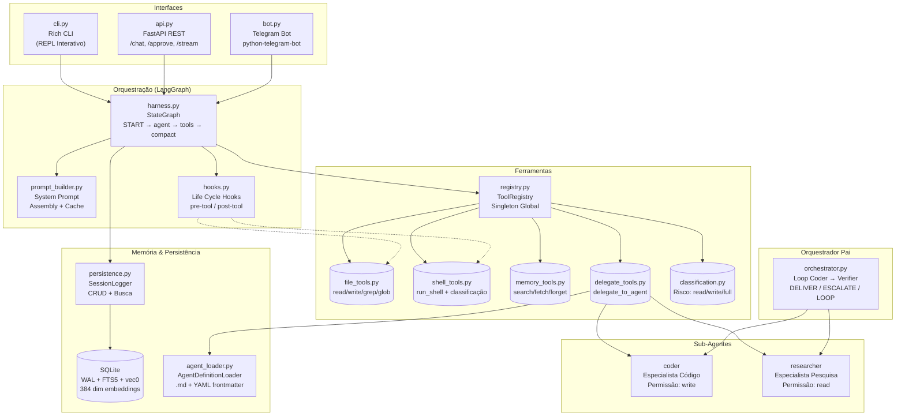

# 🤖 Agent Harness

[](https://python.org)
[](LICENSE)
[](https://langchain-ai.github.io/langgraph/)
[](https://fastapi.tiangolo.com)
[](https://sqlite.org)
[](https://docs.astral.sh/uv/)
[](https://github.com/psf/black)
[](https://github.com/pre-commit/pre-commit)

> **Versão:** 0.1.0 · **Autor:** Kleberson · **Licença:** MIT (2026)

---

## 📋 Sobre o Projeto

O **Agent Harness** é um framework de **orquestração multi-agente** com memória em camadas, busca híbrida (FTS5 + vetorial), e controles de segurança com **human-in-the-loop**. O sistema implementa uma arquitetura **Agente Pai (Orquestrador) + Sub-Agentes Especialistas**, onde o Orquestrador nunca executa tarefas diretamente — apenas delega para especialistas via `delegate_to_agent`.

Projetado para ser **extensível**, **seguro** e **observável**, o framework permite construir agentes de IA complexos com persistência de memória, aprovação humana para operações sensíveis, e suporte a múltiplos provedores de LLM.

---

## ✨ Funcionalidades

| Funcionalidade | Descrição |
|---|---|
| 🔀 **Orquestração Delegativa** | Agente Pai identifica o especialista necessário e delega; nunca executa diretamente |
| 🧠 **Memória em 3 Camadas** | L1: Cache de Sessão → L2: FTS5 + Busca Vetorial → L3: Detalhe Completo sob Demanda |
| 🔍 **Busca Híbrida** | FTS5 (palavra-chave exata) + sqlite-vec (similaridade semântica com cosseno, 384 dims) |
| 🛡️ **Human-in-the-Loop** | Portas de aprovação interativas antes de operações destrutivas (`write_file`, `run_shell`, `forget_session`) |
| 🕵️ **Modo Incógnito** | Suspende toda persistência; nenhum log é gravado no SQLite |
| 🔒 **Redação de Segredos** | Chaves de API e secrets são automaticamente mascarados via regex |
| 📦 **Compactação de Contexto** | Geração automática de "State Memo" quando o orçamento de contexto é excedido |
| 📂 **Carregamento Dinâmico** | Sub-agentes definidos em `.md` com YAML frontmatter; skills injetados na delegação |
| 🔁 **Multi-Provider LLM** | Suporte para OpenAI, Anthropic (Claude), Google, OpenRouter e Ollama (local) |
| 🔗 **Life Cycle Hooks** | Pre-tool e post-tool hooks para extensibilidade sem tocar no harness |
| 🔄 **Loop de Correção** | Orquestrador com loop coder → verifier com max retries e decisão DELIVER/ESCALATE |
| 🖥️ **CLI Interativa** | REPL com Rich (tabelas, cores, prompts, status) + opção de retomar sessões |
| 🌐 **REST API** | Endpoints FastAPI: `/chat`, `/approve`, `/stream`, `/status`, `/health` |
| 📱 **Telegram Bot** | Integração completa com Telegram, incluindo autorização por user ID |

---

## 🛠️ Stack Tecnológica

| Categoria | Tecnologia |
|---|---|
| **Linguagem** | Python 3.13+ |
| **Orquestração** | LangGraph (StateGraph) |
| **LLM** | LangChain + OpenAI / Anthropic / Google / OpenRouter / Ollama |
| **API** | FastAPI + Uvicorn |
| **Persistência** | SQLAlchemy + SQLite (WAL mode, FTS5, sqlite-vec) |
| **Embeddings** | HuggingFace (all-MiniLM-L6-v2, 384 dims) |
| **CLI** | Rich (console, panels, tables, prompts) |
| **Telegram** | python-telegram-bot 22+ |
| **Validação** | Pydantic v2 |
| **Testes** | pytest + pytest-asyncio + pytest-cov |
| **Observabilidade** | LangSmith (opcional) |
| **Segurança** | pre-commit hooks, redação de segredos, controle de permissões |
| **Gerenciamento** | uv (package manager), Makefile |

---

## 🚀 Instalação

### Pré-requisitos

- Python 3.13+
- [uv](https://docs.astral.sh/uv/) (gerenciador de pacotes)
- Git

### Passo a Passo

```bash
# 1. Clone o repositório
git clone https://github.com/seu-usuario/agent-harness.git
cd agent-harness

# 2. Execute o setup inicial (copia .env.template e instala dependências)
make setup

# 3. Configure as variáveis de ambiente
cp .env.template .env
# Edite o .env com suas chaves de API (veja seção abaixo)
```

Ou manualmente:

```bash
uv sync                    # Instalar dependências
uv run pre-commit install  # Instalar hooks de segurança
```

---

## ⚙️ Configuração

### Variáveis de Ambiente

Copie o template `.env.template` para `.env` e configure:

| Variável | Default | Obrigatório | Descrição |
|---|---|---|---|
| `AI_PROVIDER` | `openrouter` | ✅ | Provider do LLM: `openai`, `anthropic`, `google`, `openrouter`, `ollama` |
| `AI_MODEL` | `anthropic/claude-3.5-sonnet` | ✅ | Nome/identificador do modelo |
| `OPENAI_API_KEY` | — | Condicional | API key da OpenAI (se provider=openai) |
| `ANTHROPIC_API_KEY` | — | Condicional | API key da Anthropic (se provider=anthropic) |
| `OPENROUTER_API_KEY` | — | Condicional | API key do OpenRouter (se provider=openrouter) |
| `GOOGLE_API_KEY` | — | Condicional | API key do Google (se provider=google) |
| `OLLAMA_BASE_URL` | `http://127.0.0.1:11434` | ❌ | URL do servidor Ollama |
| `HARNESS_PERMISSIONS` | `execute` | ❌ | Permissão padrão: `read`, `write` ou `execute` |
| `LANGSMITH_TRACING` | — | ❌ | Ativa tracing LangSmith: `true` ou `false` |
| `LANGSMITH_ENDPOINT` | — | ❌ | Endpoint da API LangSmith |
| `LANGSMITH_API_KEY` | — | ❌ | API key do LangSmith |
| `LANGSMITH_PROJECT` | — | ❌ | Nome do projeto no LangSmith |
| `TELEGRAM_BOT_TOKEN` | — | ❌ | Token do bot Telegram (para usar o bot) |
| `ALLOWED_TELEGRAM_USERS` | — | ❌ | IDs de usuários permitidos (separados por vírgula). Vazio = todos |

### Níveis de Permissão

```
read (1) → write (2) → execute (3)
```

| Permissão | Ferramentas Disponíveis |
|---|---|
| `read` | `list_directory`, `read_file`, `grep_search`, `glob_search`, `search_memory`, `fetch_memory_detail`, `delegate_to_agent` |
| `write` | Todas de `read` + `write_file`, `replace_string` |
| `execute` | Todas de `write` + `run_shell`, `forget_session` |

---

## 📖 Como Usar

### 🖥️ CLI Interativo

```bash
# Iniciar o CLI interativo
make cli

# Ou diretamente
uv run python entrypoints/cli.py

# Modo YOLO (sem aprovações humanas)
make yolo
```

**Comandos especiais no CLI:**
- `/help` — Exibir ajuda
- `/history` — Ver histórico da sessão
- `/clear` — Limpar contexto
- `/session [id]` — Trocar ou criar sessão
- `/yolo` — Toggle modo YOLO
- `/incognito` — Toggle modo incógnito
- `/exit` ou `Ctrl+C` — Sair

---

### 🌐 REST API

#### Iniciar o servidor

```bash
# Desenvolvimento (foreground com reload)
make run

# Produção (background)
make start

# Verificar status
make status
```

#### Endpoints

##### `POST /chat` — Interação Conversacional

```bash
# Nova conversa
curl -X POST http://localhost:8000/chat \
  -H "Content-Type: application/json" \
  -d '{"message": "Liste os arquivos do diretório atual"}'

# Continuar sessão (use o session_id retornado)
curl -X POST http://localhost:8000/chat \
  -H "Content-Type: application/json" \
  -d '{
    "message": "Agora analise o conteúdo",
    "session_id": "a1b2c3d4-...",
    "permissions": "read"
  }'
```

**Request Body:**
```json
{
  "message": "string (obrigatório, máx 10000 chars)",
  "session_id": "string (opcional, uuid4 auto-gerado)",
  "permissions": "string (opcional: read | write | execute)"
}
```

**Response:**
```json
{
  "session_id": "a1b2c3d4-...",
  "response": "Com base na análise dos arquivos...",
  "history_length": 5
}
```

##### `POST /approve/{approval_id}` — Aprovar Ação Pendente

```bash
# Aprovar
curl -X POST http://localhost:8000/approve/12345-abcde \
  -H "Content-Type: application/json" \
  -d '{"approved": true}'

# Rejeitar
curl -X POST http://localhost:8000/approve/12345-abcde \
  -H "Content-Type: application/json" \
  -d '{"approved": false}'
```

##### `GET /stream/{session_id}` — SSE Streaming

```bash
curl http://localhost:8000/stream/a1b2c3d4-...
```

Recebe eventos Server-Sent em tempo real (thinking, tool_start, tool_end, approval_required, error).

##### `GET /status/{session_id}` — Status da Sessão

```bash
curl http://localhost:8000/status/a1b2c3d4-?
```

##### `GET /health` — Healthcheck

```bash
curl http://localhost:8000/health
```

---

### 📱 Telegram Bot

```bash
# Iniciar o bot (foreground)
make bot

# Iniciar em background
make bot-start

# Parar
make bot-stop

# Ver status
make bot-status
```

**Requer:**
- `TELEGRAM_BOT_TOKEN` no `.env`
- `ALLOWED_TELEGRAM_USERS` no `.env` (IDs separados por vírgula) — vazio permite todos

**Comandos do Bot:**
- `/start` — Inicializar sessão
- `/help` — Lista de comandos
- `/reset` — Reiniciar sessão
- `/status` — Status atual
- `/yolo` — Toggle modo YOLO

---

## 🏗️ Arquitetura

### Diagrama de Alto Nível



### Fluxo de Execução

```
1. Mensagem recebida (CLI/API/Bot)
2. Carrega histórico da sessão (SessionLogger)
3. Monta system prompt (com cache)
4. LangGraph executa o ciclo:
   ┌──────────────────────────────────────────────┐
   │  agent (call_model) → LLM decide próxima ação │
   │       ↓                                       │
   │  should_continue?                             │
   ├─→ [tool_calls] → tools (execute_tools)        │
   │       ↓         (HITL se requires_approval)   │
   │       └──────── → agent (próxima decisão)      │
   ├─→ [compact] → compact_context                 │
   │       ↓         (gera State Memo)              │
   │       └──────── → agent                       │
   └─→ [end] → resposta final                      │
5. Persiste mensagens no SQLite
6. Retorna resposta ao usuário
```

### Componentes Principais

| Componente | Arquivo | Responsabilidade |
|---|---|---|
| **StateGraph** | `core/harness.py` | Orquestra o fluxo agent → tools → compact |
| **HarnessState** | `core/state.py` | Estado: messages, scratchpad, permissions, flags |
| **call_model** | `core/model_caller.py` | Invoca o LLM com ferramentas vinculadas |
| **execute_tools** | `core/tool_executor.py` | Executa tools com verificação de permissão + HITL |
| **compact_context** | `core/compaction.py` | Gera State Memo quando orçamento excedido |
| **should_continue** | `core/dialog_control.py` | Decide próximo nó (tools, compact, end) |
| **ToolRegistry** | `tools/registry.py` | Singleton global de ferramentas |
| **SessionLogger** | `infra/persistence.py` | CRUD + busca híbrida (FTS5 + vetorial) |
| **AgentLoader** | `infra/agent_loader.py` | Carrega agentes/skills de .md com YAML |
| **UIInterface** | `core/ui_interface.py` | Interface de eventos (CLI/API/Bot) |

---

## 🤖 Sub-Agentes e Skills

### Sub-Agentes Disponíveis

Os sub-agentes são carregados dinamicamente de `.agents/agents/*.md` com YAML frontmatter.

| Agente | ID | Permissão | Descrição |
|---|---|---|---|
| 🛠️ **Architect** | `architect` | `read` | Especialista em design de sistemas, padrões e integridade arquitetural |
| 🛠️ **Coder** | `coder` | `write` | Especialista em escrita de código, refatoração e correção de bugs |
| 🔬 **Researcher** | `researcher` | `read` | Especialista em busca semântica e análise de documentos |
| ✅ **Verifier** | `verifier` | `read` | Validação de código, testes e artefatos; verifica cobertura >= 90% |

### Skills Disponíveis

Skills são injetadas automaticamente na delegação quando relevantes.

| Skill | Descrição |
|---|---|
| `python-patterns` | Padrões e boas práticas Python |
| `python-uv` | Gestão de projetos com uv (pyproject.toml, CI/CD) |
| `youtube-transcript` | Extração e limpeza de transcrições de vídeos YouTube |
| `fastapi-expert` | Expertise em desenvolvimento FastAPI |

### Como Adicionar um Novo Sub-Agente

1. Crie o arquivo `.agents/agents/meu-agente.md`:

```markdown
---
name: Meu Agente
description: Descrição breve do agente
permissions: read
---

Você é o Meu Agente, especialista em...

## Diretrizes
- Regra 1
- Regra 2
```

2. O agente será carregado automaticamente.

---

## 📂 Estrutura do Projeto

```
.
├── .agents/                    # Definições de agentes, skills e tools
│   ├── agents/                 # Sub-agentes (.md + YAML frontmatter)
│   │   ├── coder.md
│   │   └── researcher.md
│   ├── skills/                 # Skills injetadas na delegação
│   │   ├── python-patterns/    # (diretório com SKILL.md)
│   │   ├── python-uv/
│   │   ├── youtube-transcript/
│   │   └── fastapi-expert/
│   └── tools/                  # Manuais das ferramentas (.md)
├── core/                       # Lógica central do harness
│   ├── compaction.py           # Compactação de contexto
│   ├── dialog_control.py       # Controle de fluxo (should_continue)
│   ├── harness.py              # StateGraph do LangGraph
│   ├── hooks.py                # Hooks de ciclo de vida
│   ├── model_caller.py         # Chamadas ao modelo LLM
│   ├── model_config.py         # Configuração multi-provider LLM
│   ├── prompt_builder.py       # Assembly + cache do system prompt
│   ├── state.py                # HarnessState (TypedDict)
│   ├── tool_executor.py        # Executor de ferramentas
│   ├── ui_interface.py         # Interface de eventos UI
│   └── utils.py                # Utilitários (cap_output, recursive_load)
├── entrypoints/                # Pontos de entrada
│   ├── api.py                  # FastAPI REST API
│   ├── bot.py                  # Telegram Bot
│   └── cli.py                  # CLI interativo (Rich)
├── infra/                      # Infraestrutura
│   ├── agent_loader.py         # Carregamento de agentes/skills/tools
│   ├── logging_config.py       # Configuração de logging
│   ├── persistence.py          # SessionLogger (CRUD + busca)
│   └── persistence_db.py       # SQLAlchemy models
├── scripts/
│   └── check_secrets.py        # Verificação de segredos no código
├── tools/                      # Ferramentas do agente
│   ├── classification.py       # Classificação de risco de comandos shell
│   ├── delegate_tools.py       # Delegação para sub-agentes
│   ├── file_tools.py           # Operações de arquivo (CRUD + busca)
│   ├── memory_tools.py         # Busca e gerenciamento de memória
│   ├── registry.py             # Registro global de ferramentas
│   └── shell_tools.py          # Execução de comandos shell
├── tests/                      # Suíte de testes
│   ├── conftest.py             # Fixtures compartilhados
│   ├── unit/                   # Testes unitários (22 módulos)
│   ├── integration/            # Testes de integração (4 flows)
│   ├── e2e/                    # Testes end-to-end (2 suites)
│   ├── edge_cases/             # Testes de caso de borda (5 suites)
│   └── (testes na raiz)        # Testes complementares
├── .env.template               # Template de variáveis de ambiente
├── AGENTS.md                   # Catálogo de agentes (protocolo)
├── ARCH.md                     # Documentação de arquitetura (682 linhas)
├── Makefile                    # Comandos de build/run/test
├── pyproject.toml              # Dependências e configuração
├── pytest.ini                  # Configuração do pytest
├── TOOLS.md                    # Manual de ferramentas (auto-gerado)
├── LICENSE                     # MIT License
└── README.md                   # Este arquivo
```

---

## 🧪 Desenvolvimento

### Comandos Make

| Comando | Descrição |
|---|---|
| `make setup` | Setup inicial (copia .env, instala deps) |
| `make install` | Instalar dependências via `uv sync` |
| `make run` | API em foreground (com reload) |
| `make start` | API em background |
| `make stop` | Parar API em background |
| `make restart` | Reiniciar API |
| `make status` | Verificar se API está rodando |
| `make cli` | Iniciar CLI interativo |
| `make bot` | Iniciar Telegram bot (foreground) |
| `make bot-start` | Bot em background |
| `make bot-stop` | Parar bot |
| `make bot-status` | Status do bot |
| `make yolo` | CLI modo YOLO (sem aprovações) |
| `make clear-memory` | Limpar todas as sessões e memória (SQLite) |
| `make setup-hooks` | Instalar pre-commit hooks |
| `make generate-tools` | Regenerar TOOLS.md a partir dos manuais |
| `make logs` | Ver logs da API |
| `make test` | Rodar testes (pytest) |
| `make clean` | Limpar arquivos temporários |

### Rodando Testes

```bash
# Todos os testes
make test

# Com coverage
uv run pytest --cov=. --cov-report=term-missing

# Testes específicos
uv run pytest tests/unit/          # Apenas unitários
uv run pytest tests/integration/   # Apenas integração
uv run pytest tests/e2e/           # Apenas e2e
uv run pytest tests/edge_cases/    # Apenas edge cases

# Teste específico
uv run pytest tests/unit/test_compaction_unit.py -v
```

### Pre-commit Hooks

```bash
# Instalar hooks
make setup-hooks

# Rodar manualmente
uv run pre-commit run --all-files
```

Os hooks verificam:
- Formatação de código
- Segredos expostos (chaves de API)
- Sintaxe Python

---

## 🔒 Segurança

O Agent Harness implementa múltiplas camadas de segurança:

1. **Controle de Permissões** — Hierarquia `read` → `write` → `execute`; ferramentas só são expostas conforme o nível.
2. **Human-in-the-Loop (HITL)** — Aprovação obrigatória para operações destrutivas (`write_file`, `run_shell`, `forget_session`).
3. **Redação de Segredos** — Chaves de API (OpenAI, Anthropic, Google) mascaradas automaticamente via regex em logs e outputs.
4. **Classificação de Comandos Shell** — `tools/classification.py` classifica comandos em `read`/`write`/`full` risk antes da execução.
5. **Pre-commit Hooks** — `scripts/check_secrets.py` escaneia arquivos por API keys antes do commit; hooks de formatação e YAML.
6. **Life Cycle Hooks** — `core/hooks.py` permite registrar pre-tool hooks (podem bloquear/modificar) e post-tool hooks (audit/observabilidade).
7. **Autorização Telegram** — Lista de IDs permitidos para interação via bot.
8. **Modo Incógnito** — Desativa toda persistência quando necessário (nenhum log no SQLite).
9. **Modo YOLO** — Pula aprovações interativas (apenas para desenvolvimento).

---

## 📊 Observabilidade

### LangSmith Tracing

Para ativar o tracing:

```env
LANGSMITH_TRACING=true
LANGSMITH_ENDPOINT="https://api.smith.langchain.com"
LANGSMITH_API_KEY="sua-chave"
LANGSMITH_PROJECT="agent-harness"
```

### Logs

```bash
# Ver logs da API
make logs

# Logs do bot (background)
tail -f bot.log
```

---

## 📝 Exemplos de Uso

### Exemplo 1: Análise de Código via CLI

```bash
$ make cli
> Analise a estrutura do projeto e identifique padrões de código

🤖 Agent: Vou analisar a estrutura do projeto...
   → Executando list_directory...
   → Executando grep_search...
   → Executando read_file...

   O projeto segue uma arquitetura modular com...
```

### Exemplo 2: Delegação para Sub-Agente

```bash
> Escreva uma função Python para calcular Fibonacci

🤖 Agent: Vou delegar para o especialista em código...
   → Executando delegate_to_agent(agent_id='coder', mission='...')

   🛠️ Coder: Aqui está a implementação...
```

### Exemplo 3: API REST

```bash
curl -X POST http://localhost:8000/chat \
  -H "Content-Type: application/json" \
  -d '{"message": "Qual a arquitetura do projeto?", "permissions": "read"}'
```

### Exemplo 4: Modo Incógnito

```bash
$ make cli
> /incognito
Modo incógnito ativado. Nenhum log será gravado.

> Analise este código confidencial...
```

---

## 🤝 Contribuindo

Contribuições são bem-vindas! Para contribuir:

1. Fork o repositório
2. Crie uma branch (`git checkout -b feature/minha-feature`)
3. Commit suas mudanças (`git commit -m 'Adiciona feature'`)
4. Push para a branch (`git push origin feature/minha-feature`)
5. Abra um Pull Request

**Antes de enviar:**
- Certifique-se de que os testes passam: `make test`
- Verifique o coverage (mínimo 90%): `make test-cov`
- Rode os hooks: `uv run pre-commit run --all-files`
- Todo código deve ter testes: unitários, integração, e2e e edge cases (conforme `AGENTS.md`)

**Padrões de Qualidade:**
- Cobertura de testes >= 90% (`make test-cov`)
- Pre-commit hooks ativos (`make setup-hooks`)
- Documentação atualizada para novas funcionalidades
- Seguir o fluxo de delegação: Orquestrador → coder → verifier → decisão

---

## 📄 Licença

Este projeto está licenciado sob a **MIT License** — veja o arquivo [LICENSE](LICENSE) para detalhes.

```
MIT License
Copyright (c) 2026 Kleberson
```

---

## 🔗 Referências

| Recurso | Link |
|---|---|
| **LangGraph** | [langchain-ai.github.io/langgraph](https://langchain-ai.github.io/langgraph/) |
| **LangChain** | [python.langchain.com](https://python.langchain.com/) |
| **FastAPI** | [fastapi.tiangolo.com](https://fastapi.tiangolo.com/) |
| **SQLAlchemy** | [docs.sqlalchemy.org](https://docs.sqlalchemy.org/) |
| **SQLite FTS5** | [sqlite.org/fts5.html](https://www.sqlite.org/fts5.html) |
| **sqlite-vec** | [github.com/asg017/sqlite-vec](https://github.com/asg017/sqlite-vec) |
| **Rich** | [rich.readthedocs.io](https://rich.readthedocs.io/) |
| **uv** | [docs.astral.sh/uv](https://docs.astral.sh/uv/) |
| **Pydantic** | [docs.pydantic.dev](https://docs.pydantic.dev/) |
| **LangSmith** | [smith.langchain.com](https://smith.langchain.com/) |

---

## 📞 Contato

- **Autor:** Kleberson
- **Licença:** MIT (2026)

---

<p align="center">
  <sub>Built with ❤️ using Python, LangGraph, and FastAPI</sub>
</p>
