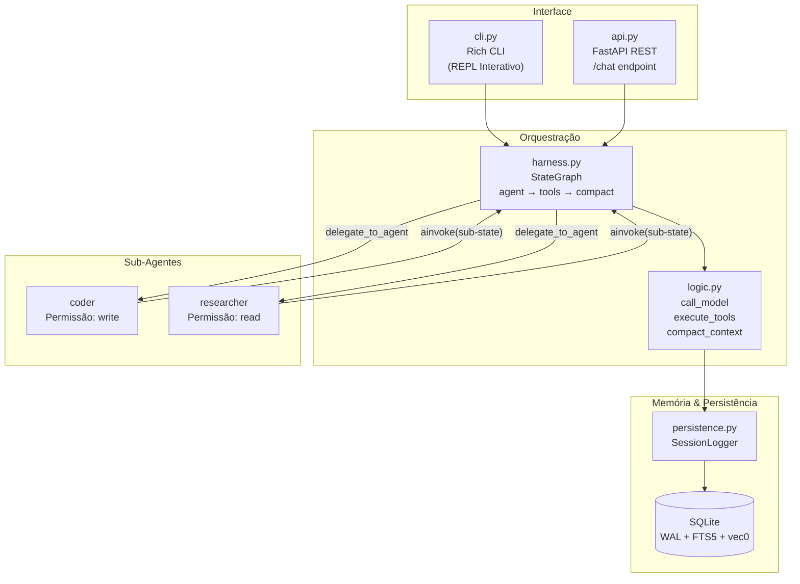

# 🤖 Agent Harness

[](https://python.org)
[](LICENSE)
[](https://langchain-ai.github.io/langgraph/)
[](https://fastapi.tiangolo.com)
[](https://sqlite.org)
[](https://docs.astral.sh/uv/)

Um framework de **orquestração multi-agente** com memória em camadas, busca híbrida (FTS5 + vetorial), e controles de segurança com **human-in-the-loop**. O sistema implementa uma arquitetura **Agente Pai (Orquestrador) + Sub-Agentes Especialistas**, onde o Orquestrador nunca executa tarefas diretamente — apenas delega para especialistas via `delegate_to_agent`.

---

## ✨ Funcionalidades

- **🔀 Orquestração Delegativa** — Agente Pai identifica o especialista necessário e delega; nunca executa diretamente
- **🧠 Memória em 3 Camadas** — L1: Cache de Sessão → L2: FTS5 + Busca Vetorial → L3: Detalhe Completo sob Demanda
- **🔍 Busca Híbrida** — FTS5 (palavra-chave exata) + sqlite-vec (similaridade semântica com cosseno, 384 dims)
- **🛡️ Human-in-the-Loop** — Portas de aprovação interativas antes de operações destrutivas (`write_file`, `run_shell`, `forget_session`)
- **🕵️ Modo Incógnito** — Suspende toda persistência; nenhum log é gravado no SQLite
- **🔒 Redação de Segredos** — Chaves de API e secrets são automaticamente mascarados via regex
- **📦 Compactação de Contexto** — Geração automática de "State Memo" quando o orçamento de contexto é excedido
- **📂 Carregamento Dinâmico** — Sub-agentes definidos em `.md` com YAML frontmatter; skills injetados na delegação
- **🔁 Multi-Provider LLM** — Suporte para OpenAI, Anthropic (Claude), Google e OpenRouter
- **🖥️ CLI Interativa** — REPL com Rich (tabelas, cores, prompts, status) + opção de retomar sessões
- **🌐 REST API** — Endpoint FastAPI `/chat` para integração externa

---

## 🏗️ Arquitetura



**Fluxo de execução:**

1. O usuário envia uma mensagem via CLI ou API
2. O **Orquestrador** monta o System Prompt com catálogo de especialistas e contexto
3. O LLM decide: se precisa de uma ferramenta, o nó **execute_tools** a executa
4. Se a ferramenta é `delegate_to_agent`, um **sub-agente** é spawnado com contexto isolado
5. Sub-agentes executam autonomamente e retornam um **Technical Report** ao orquestrador
6. Quando oContext budget é excedido, **compact_context** gera um State Memo e salva na memória vetorial
7. O ciclo continua até uma resposta final (sem `tool_calls`) ou atingir o limite de 25 iterações

---

## 🛠️ Tecnologias

| Categoria | Tecnologia |
|---|---|
| **Linguagem** | Python 3.13+ |
| **Orquestração** | LangGraph (StateGraph com nós e arestas condicionais) |
| **LLM Framework** | LangChain (init_chat_model, message types) |
| **Providers LLM** | langchain-openai, langchain-anthropic, langchain-openrouter |
| **Embeddings** | sentence-transformers/all-MiniLM-L6-v2 (384 dimensões) |
| **API** | FastAPI + Uvicorn (ASGI) |
| **Banco de Dados** | SQLite com WAL mode, FTS5 Virtual Table, sqlite-vec (SIMD nativo) |
| **ORM** | SQLAlchemy 2.0 |
| **CLI** | Rich (Tabelas, painéis, prompts, status) |
| **Validação** | Pydantic 2.x |
| **Configuração** | PyYAML (YAML frontmatter), python-dotenv |
| **Observabilidade** | LangSmith (opcional, tracing) |
| **Gerenciador** | uv (lock file, resolução de dependências) |

---

## 🚀 Instalação e Uso

### Pré-requisitos

- [uv](https://docs.astral.sh/uv/) instalado
- Python 3.13+

### Instalação

```bash
# Clone o repositório
git clone <repo-url>
cd agent-harness

# Instale as dependências
make install
# ou diretamente: uv sync
```

### CLI Interativo

```bash
make cli
# ou: uv run python cli.py
```

O CLI apresenta:
- Banner com versão e provider
- Opção de **retomar sessões** anteriores (lista tabelada via Rich)
- Cores diferenciadas: You (yellow), Agent (magenta), Tool Result (green)
- Digite `exit` ou `quit` para encerrar

### API REST

```bash
# Desenvolvimento (foreground)
make run

# Produção (background)
make start
make stop
make restart
make status
```

Comandos disponíveis:

| Comando | Descrição |
|---|---|
| `make install` | Instala dependências via `uv sync` |
| `make run` | Executa API em foreground com `--reload` |
| `make start` | Inicia API em background (log em `api.log`) |
| `make stop` | Para o processo da API |
| `make restart` | Reinicia a API |
| `make status` | Verifica se a API está rodando |
| `make cli` | Inicia o CLI interativo |
| `make clear-memory` | Apaga todas as sessões e memórias (SQLite) |

---

## ⚙️ Configure o arquivo `.env`

Copie o template e ajuste as variáveis de ambiente:

```bash
cp .env.template .env
```

| Variável | Default | Descrição |
|---|---|---|
| `AI_PROVIDER` | `openrouter` | Provider do LLM: `openai`, `anthropic`, `google`, `openrouter` |
| `AI_MODEL` | `anthropic/claude-3.5-sonnet` | Nome/identificador do modelo |
| `OPENAI_API_KEY` | — | API key da OpenAI (obrigatório se provider=openai) |
| `ANTHROPIC_API_KEY` | — | API key da Anthropic (obrigatório se provider=anthropic) |
| `OPENROUTER_API_KEY` | — | API key do OpenRouter (obrigatório se provider=openrouter) |
| `HARNESS_PERMISSIONS` | `execute` | Permissão padrão no CLI: `read`, `write` ou `execute` |
| `LANGSMITH_TRACING` | — | Ativa tracing LangSmith: `true` ou `false` |
| `LANGSMITH_ENDPOINT` | — | Endpoint da API LangSmith |
| `LANGSMITH_API_KEY` | — | API key do LangSmith |
| `LANGSMITH_PROJECT` | — | Nome do projeto no LangSmith |

---

## 📡 Documentação da API

### `POST /chat`

Endpoint principal para interação conversacional com o agente.

#### Request

```json
{
"message": "Analise a arquitetura do projeto",
"session_id": "optional-uuid-v4",
"permissions": "read"
}
```

| Campo | Tipo | Default | Descrição |
|---|---|---|---|
| `message` | `string` | **obrigatório** | Mensagem do usuário |
| `session_id` | `string` | `uuid4()` (gerado) | ID da sessão para continuar conversas |
| `permissions` | `string` | `"read"` | Nível de permissão: `read`, `write` ou `execute` |

#### Response

```json
{
"session_id": "a1b2c3d4-...",
"response": "Com base na análise dos arquivos, o projeto utiliza...",
"history_length": 5
}
```

| Campo | Tipo | Descrição |
|---|---|---|
| `session_id` | `string` | ID da sessão (use para continuar) |
| `response` | `string` | Resposta final do agente |
| `history_length` | `integer` | Quantidade de mensagens na sessão |

#### Exemplos

**Nova conversa:**

```bash
curl -X POST http://localhost:8000/chat \
-H "Content-Type: application/json" \
-d '{"message": "Liste os arquivos do diretório atual"}'
```

**Continuar sessão:**

```bash
curl -X POST http://localhost:8000/chat \
-H "Content-Type: application/json" \
-d '{
"message": "Agora leia o README.md",
"session_id": "a1b2c3d4-...",
"permissions": "read"
}'
```

**Operação que requer aprovação (write):**

```bash
curl -X POST http://localhost:8000/chat \
-H "Content-Type: application/json" \
-d '{
"message": "Crie um arquivo hello.txt com Hello World",
"permissions": "write"
}'
```

---

## 📄 Licença

Este projeto está licenciado sob a **MIT License** — consulte o arquivo [LICENSE](LICENSE) para detalhes.
